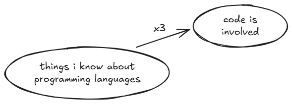
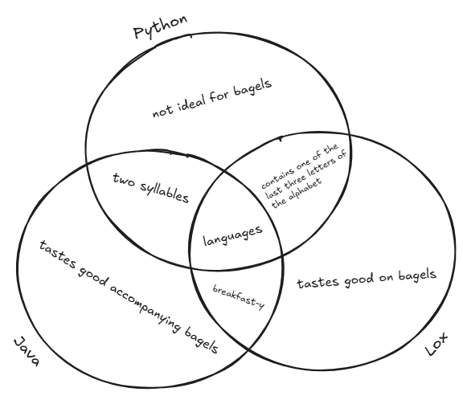

# Old Deliverables for CMPSC 201 (Fall 2025)

This reference contains a list of all weekly deliverables for the fall 2025
semester of CMPSC 201. Since the course's GitHub organization main page only
contains the current week's deliverables, you can reference this list of old
and past-due assignments if you're a) curious about the road we've traveled so
far, or b) trying to make up some work with a token.

## Commit Week One Deliverables (8/26)

- **Individual Deliverable:** *by Tuesday @ 11:59pm*, complete the
  [introductory survey](https://forms.gle/6rm7CV8u9KViWBZg7)

- **Discord Discussion:** *by Wednesday @ 11:59pm*, post a novel insight
  (meaning something that one of your peers has not already shared) to this
  week's Discord thread about domain-specific languages

- **Team Deliverable:** *by Thursday @ 11:59pm*, create a team repository within
  our course organization that all team members have access to, and populate the
  README.md with a code of conduct

- **Reflection Entry:** *by Saturday @ 11:59pm*, create an individual repository
  within our course organization, and (using whatever organizational structure
  you deem fit) add a single markdown file that has a 200 word (minimum) answer
  to the following prompt:
  
  > Why am I taking CMPSC 201? How does this course and its stated learning
  > objectives fit into my academic/professional/personal goals?

- **Mapmaking Task:** *by Saturday @ 11:59pm*, within the same repository that
  you'll store your reflection entries in, add an image file exported from
  [excalidraw](https://excalidraw.com/) that denotes at least three things you
  already know (or at least think you know) about the course topic:

  

## Commit Week Two Deliverables (9/1)

- **Discord Discussion:** *by Wednesday @ 11:59pm*, post a novel insight
  (meaning something that one of your peers has not already shared) to this
  week's Discord thread about the parts of a language

- **Team Deliverable:** *by Friday @ 7:59pm*, have every team member
  successfully demo a simple `hello world` style Java program for the professor;
  this demo must include both a successful compilation and a successful program
  execution ([this](https://code.visualstudio.com/docs/languages/java) should
  be a useful resource for getting your workspace set up)

- **Individual Deliverable:** *by Friday @ 7:59pm*, demo a toy Java program for
  the professor (and push it to your individual repository); it doesn't matter
  what the program *does*, but the code must include these three things at
  minimum:

  - some form of
    [arithmetic](https://www.w3schools.am/java/java_operators.html#gsc.tab=0)

  - some control flow logic, utilizing either
    [if](https://www.w3schools.am/java/java_conditions.html#gsc.tab=0),
    [while](https://www.w3schools.am/java/java_while_loop.html#gsc.tab=0),
    or [for](https://www.w3schools.am/java/java_for_loop.html#gsc.tab=0)

  - at least one
    [method](https://www.w3schools.am/java/java_methods.html#gsc.tab=0) beyond
    a `main`

- **Reflection Entry:** *by Saturday @ 11:59pm*, within your individual
  repository, add a 200 word (minimum) answer to the following prompt:
  
  > Compare and contrast Python & Java. Tell me about your familiarity with
  > either language, but also talk to me about some of your impressions of
  > what makes the two languages *similar*, as well as what makes them
  > *different*.

- **Mapmaking Task:** *by Saturday @ 11:59pm*, within your individual
  repository, add an image file exported from
  [excalidraw](https://excalidraw.com/) that identifies the eight parts of a
  language identified by Nystrom and visualizes their relationships to one
  another; more specifically, draw eight shapes (one for each part) and ensure
  each shape has at least one arrow noting how it's related to at least one
  other part, like:

  

## Commit Week Three Deliverables (9/8)

- **Discord Discussion:** *by Wednesday @ 11:59pm*, post a novel insight
  (meaning something that one of your peers has not already shared) to this
  week's Discord thread pertaining to one of Nystrom's end-of-chapter challenges

- **Team Deliverable:** *by Thursday @ 12:15pm*, submit a project charter for
  next week's team-based project, which should include:
  
  - Team roles (1 captain, 2 presenters, and 3-4 technical team members)

  - A list of the 5 toys your team will be assembling, including the language
    of implementation and the general function of the toy, keeping in mind that
    each toy must ultimately include:
    
    - At least 3 functions/methods/modules outside of a `main`-esque control
      structure

    - The utilization of at least 3 different data types

    - The capability to accept user input for the sake of facilitating *play*

  - At least two intermediate deadlines per team member

  - A schedule of performance review sessions for 9/15, 9/16, & 9/18

- **Individual Deliverable:** *by Friday @ 7:59pm*, successfully demo a Lox
  version of TheCoolerTeam's banking toy program using
  [this online Lox sandbox](https://www.yanglinzhao.com/posts/crafting-interpreters/)
  and save a copy of your code to your individual repo; hardcode a script that
  hits every option from the original program in whatever order/amounts you
  like, and be sure to display intermediate outputs from every hardcoded user
  selection

- **Reflection Entry:** *by Saturday @ 11:59pm*, within your individual
  repository, add a Markdown (`.md`) file with a 200 word (minimum) response to
  the following prompt:
  
  > Before our performance review sessions next week, you now have a chance to
  > review the instructor regarding the course. Please discuss your experience
  > in this course, and address the following questions: a) how do you feel
  > about the course structure? b) do the commit week deliverables feel like
  > they have educational value? c) does the pace of the course feel about
  > right? d) is there anything the instructor could do to make your time in the
  > course feel better?

- **Mapmaking Task:** *by Saturday @ 11:59pm*, within your individual
  repository, add an image file exported from
  [excalidraw](https://excalidraw.com/) that illustrates a Venn diagram
  comparing and contrasting Python, Java, and Lox in the below style; every
  segment of the diagram must include at least one statement, and the entire
  diagram must include a minimum of twelve comparative statements:

  