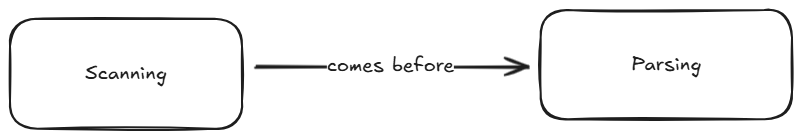

# Old Deliverables for CMPSC 201 (Fall 2025)

This reference contains a list of all weekly deliverables for the fall 2025
semester of CMPSC 201. Since the course's GitHub organization main page only
contains the current week's deliverables, you can reference this list of old
and past-due assignments if you're a) curious about the road we've traveled so
far, or b) trying to make up some work with a token.

## Commit Week One Deliverables (8/26)

- **Individual Deliverable:** *by Tuesday @ 11:59pm*, complete the
  [introductory survey](https://forms.gle/6rm7CV8u9KViWBZg7)

- **Discord Discussion:** *by Wednesday @ 11:59pm*, post a novel insight
  (meaning something that one of your peers has not already shared) to this
  week's Discord thread about domain-specific languages

- **Team Deliverable:** *by Thursday @ 11:59pm*, create a team repository within
  our course organization that all team members have access to, and populate the
  README.md with a code of conduct

- **Reflection Entry:** *by Saturday @ 11:59pm*, create an individual repository
  within our course organization, and (using whatever organizational structure
  you deem fit) add a single markdown file that has a 200 word (minimum) answer
  to the following prompt:
  
  > Why am I taking CMPSC 201? How does this course and its stated learning
  > objectives fit into my academic/professional/personal goals?

- **Mapmaking Task:** *by Saturday @ 11:59pm*, within the same repository that
  you'll store your reflection entries in, add an image file exported from
  [excalidraw](https://excalidraw.com/) that denotes at least three things you
  already know (or at least think you know) about the course topic:

  

## Commit Week Two Deliverables (9/1)

- **Discord Discussion:** *by Wednesday @ 11:59pm*, post a novel insight
  (meaning something that one of your peers has not already shared) to this
  week's Discord thread about the parts of a language

- **Team Deliverable:** *by Friday @ 7:59pm*, have every team member
  successfully demo a simple `hello world` style Java program for the professor;
  this demo must include both a successful compilation and a successful program
  execution ([this](https://code.visualstudio.com/docs/languages/java) should
  be a useful resource for getting your workspace set up)

- **Individual Deliverable:** *by Friday @ 7:59pm*, demo a toy Java program for
  the professor (and push it to your individual repository); it doesn't matter
  what the program *does*, but the code must include these three things at
  minimum:

  - some form of
    [arithmetic](https://www.w3schools.am/java/java_operators.html#gsc.tab=0)

  - some control flow logic, utilizing either
    [if](https://www.w3schools.am/java/java_conditions.html#gsc.tab=0),
    [while](https://www.w3schools.am/java/java_while_loop.html#gsc.tab=0),
    or [for](https://www.w3schools.am/java/java_for_loop.html#gsc.tab=0)

  - at least one
    [method](https://www.w3schools.am/java/java_methods.html#gsc.tab=0) beyond
    a `main`

- **Reflection Entry:** *by Saturday @ 11:59pm*, within your individual
  repository, add a 200 word (minimum) answer to the following prompt:
  
  > Compare and contrast Python & Java. Tell me about your familiarity with
  > either language, but also talk to me about some of your impressions of
  > what makes the two languages *similar*, as well as what makes them
  > *different*.

- **Mapmaking Task:** *by Saturday @ 11:59pm*, within your individual
  repository, add an image file exported from
  [excalidraw](https://excalidraw.com/) that identifies the eight parts of a
  language identified by Nystrom and visualizes their relationships to one
  another; more specifically, draw eight shapes (one for each part) and ensure
  each shape has at least one arrow noting how it's related to at least one
  other part, like:

  

## Commit Week Three Deliverables (9/8)

- **Discord Discussion:** *by Wednesday @ 11:59pm*, post a novel insight
  (meaning something that one of your peers has not already shared) to this
  week's Discord thread pertaining to one of Nystrom's end-of-chapter challenges

- **Team Deliverable:** *by Thursday @ 12:15pm*, submit a project charter for
  next week's team-based project, which should include:
  
  - Team roles (1 captain, 2 presenters, and 3-4 technical team members)

  - A list of the 5 toys your team will be assembling, including the language
    of implementation and the general function of the toy, keeping in mind that
    each toy must ultimately include:
    
    - At least 3 functions/methods/modules outside of a `main`-esque control
      structure

    - The utilization of at least 3 different data types

    - The capability to accept user input for the sake of facilitating *play*

  - At least two intermediate deadlines per team member

  - A schedule of performance review sessions for 9/15, 9/16, & 9/18

- **Individual Deliverable:** *by Friday @ 7:59pm*, successfully demo a Lox
  version of TheCoolerTeam's banking toy program using
  [this online Lox sandbox](https://www.yanglinzhao.com/posts/crafting-interpreters/)
  and save a copy of your code to your individual repo; hardcode a script that
  hits every option from the original program in whatever order/amounts you
  like, and be sure to display intermediate outputs from every hardcoded user
  selection

- **Reflection Entry:** *by Saturday @ 11:59pm*, within your individual
  repository, add a Markdown (`.md`) file with a 200 word (minimum) response to
  the following prompt:
  
  > Before our performance review sessions next week, you now have a chance to
  > review the instructor regarding the course. Please discuss your experience
  > in this course, and address the following questions: a) how do you feel
  > about the course structure? b) do the commit week deliverables feel like
  > they have educational value? c) does the pace of the course feel about
  > right? d) is there anything the instructor could do to make your time in the
  > course feel better?

- **Mapmaking Task:** *by Saturday @ 11:59pm*, within your individual
  repository, add an image file exported from
  [excalidraw](https://excalidraw.com/) that illustrates a Venn diagram
  comparing and contrasting Python, Java, and Lox in the below style; every
  segment of the diagram must include at least one statement, and the entire
  diagram must include a minimum of twelve comparative statements:

  

## Build Week One Deliverables (9/15)

- **Language Toy Box:** for up to five possible points, work with your team to
  successfully demonstrate five playable toy programs written in five different
  languages; you'll receive one point for every toy that meets *all* of the
  following criteria:

  - Satisfies all inclusion requirements:

    - At least 3 functions/methods/modules outside of a `main`-esque control
    structure

    - The utilization of at least 3 different data types

    - The capability to accept user input for the sake of facilitating *play*

  - Does not break when being presented/demoed

  - Is presented alongside extemporaneous discussion stemming from the
    highlights of the `project-reflection.md` file, which should contain 150
    words (per toy) that addresses the following:

    - How did the language lend itself to the implementation of that toy?

    - What obstacles did you encounter?

    - If you could do this project again would you build this toy in a different
      language? Why or why not?

- **Performance Review:** for up to five possible points, engage with the
  instructor in a one-on-one conversation during your scheduled session about
  your performance thus far in the semester:

    - Three points will be derived from discussion reviewing three of your prior
      commit week deliverables, the selection of which is determined by the
      instructor

    - Two points will be derived from feedback provided by your peers regarding
      your contributions to team-based deliverables

## Commit Week Four Deliverables (9/22)

- **Discord Discussion:** *by Wednesday @ 11:59pm*, post a novel insight
  (meaning something that one of your peers has not already shared) to this
  week's Discord thread pertaining to the scanner we're building this week

- **Team Deliverable:** *by Friday @ 7:59pm*, have every team member demo a
  working version of the scanner from chapter four of the textbook, and ensure
  the following requirements are met:

  - Every team member must make at least one `commit` to at least one of the
    four files powering the scanner

  - Every team member must contribute at least three comments identifiable via
    initials (e.g., `// JN: this is my comment`) that either describe what
    Nystrom's code is doing or otherwise provide additional context

- **Individual Deliverable:** *by Saturday @ 11:59pm*, create a
  `learning-objectives` folder in your individual repository, and add a file
  `learning-objective-two.md` that contains a 500 word statement detailing
  how you've grappled with and demonstrated some level of competency with
  the second learning objective for this course:

  > Effectively use programming language constructs to design correct,
  > efficient, and well-tested programs in multiple programming languages,
  > including but not limited to Java.

- **Reflection Entry:** *by Saturday @ 11:59pm*, within your individual
  repository, add a Markdown (`.md`) file with a 200 word (minimum) response to
  the following prompt:
  
  > We've made it through 25% of the semester, and 25% of the possible points
  > have been dealt out at this point. With this in mind, take your current
  > overall score from the latest `gradebook` update and multiply your current
  > score by 4. Look at the grade conversion chart in the syllabus and determine
  > what grade that score would earn--that's the grade that you're more or less
  > on track for. Is this a grade that you're happy with? Regardless of whether
  > you're satisfied with that potential grade or not, answer these two
  > questions: a) what actions have you taken that have paved the way to your
  > current score so far? b) what strategies will you employ for the rest of
  > this semester to either maintain or pivot your current trajectory?

- **Mapmaking Task:** *by Saturday @ 11:59pm*, within your individual
  repository, add an image file exported from
  [excalidraw](https://excalidraw.com/) that illustrates a high-level view of
  how the code powering this week's scanner works; this visual representation
  must include a minimum of ten shapes that illustrate the general process, and
  should also note the expected input/output of the scanning stage
  
## Commit Week Five Deliverables (9/29)

- **Discord Discussion:** *by Wednesday @ 11:59pm*, post a novel insight
  (meaning something that one of your peers has not already shared) to this
  week's Discord thread about rules for breakfast

- **Team Deliverable:** *by Monday @ 3:59pm*, participate in our in-class
  activity around teaching context-free grammars (if you miss this class
  session, you can use a token and come to my office hours to have a one-on-one
  conversation about context-free grammars for the point)

- **Individual Deliverable:** *by Wednesday @ 11:59pm*, within your individual
  repository, write a series of (at least 25) rules for an activity in the style
  of a language grammar like Nystrom's breakfast rules; be sure to write them in
  the style of 5.1.2's condensed notation within a Markdown (`.md`) file (no
  other file types will be counted); additionally, be prepared to share them in
  class on Thursday

- **Reflection Entry:** *by Saturday @ 11:59pm*, within your individual
  repository, add a Markdown (`.md`) file (no other file types will be counted)
  with a 200 word (minimum) response to the following prompt:
  
  > Read this TIME article about
  > [AI use in the classroom](https://time.com/7295195/ai-chatgpt-google-learning-school/)
  > and briefly highlight your take-aways. What strategies will you employ in
  > this course to use AI in such a way that your learning is safeguarded?

- **Mapmaking Task:** *by Saturday @ 11:59pm*, within your individual
  repository, add a `.png` image file (no other file types will be counted)
  exported from [excalidraw](https://excalidraw.com/) that visualizes the
  generalized mechanics of how a programming language is interpeted; these
  mechanics should tie back to your map for last week about scanning (that is,
  don't clear your canvas); additionally, this time there are no requirements
  around number of entities used, but credit will only be given to those that
  comprehensively present a general understanding of how language grammars
  "work"

## Commit Week Six Deliverables (10/6)

- **Discord Discussion:** *by Wednesday @ 11:59pm*, post a novel insight
  (meaning something that one of your peers has not already shared) to this
  week's Discord thread about Nystrom's parsing code snippets

- **Team Deliverable:** *by Tuesday @ 12:14pm*, submit a project charter for
  next week's build project which includes:

  - Role assignments: one captain (responsible for the `project-charter.md`
    file) and two presenters (responsible for the `project-reflection.md`)

  - At least two intermediate deadlines per team member; each deadline should
    note the specific individuals responsible for the deadline as well as the
    date the task should be achieved by

  - A performance review schedule noting who is being reviewed on which days
    next week, based on this cadence:

    - 3/4 team members on Monday (3 for Cooler, 4 for Fornite)

    - 2 team members on Tuesday

    - 1 team member on Thursday

  - The selection of five linting rules that the team will tackle from the below
    menu:

    - A: Unused imports - import statements never used/referenced

    - B: Variable shadowing - variable names inside a function that reuse an
      outer scope variable name

    - C: Unreachable code - code after a `return`, `break`, or `continue` that
      can't be accessed

    - D: Empty blocks - `if`, `for`, and `while` statements that only contain
      `pass`

    - E: Long functions - functions that contain more than *N* statements

    - F: Naming conventions - enforcing `snake_case` for variables & functions

    - G: Magic numbers - "bare" constants used instead of named variables

    - H: Docstring enforcement - require a docstring for all functions
    
    - I: Too many parameters - detect functions with more than *N* arguments

    - J: Nested control structures - detect nesting that goes deeper than *N*
      levels

- **Individual Deliverable:** *by Wednesday @ 5:59pm*, demonstrate a working
  version of your team's Lox parser for the instructor and add at least three
  comments with your initials to the code for `Parser`, `GenerateAst`, or
  `AstPrinter`

- **Reflection Entry:** *by Wednesday @ 11:59pm*, within your individual
  repository, add a Markdown (`.md`) file (no other file types will be counted)
  with a 200 word (minimum) response to the following prompt:
  
  > Review your team's plan for tackling next week's build project. To your own
  > understanding, what will the final deliverable look like? How will it
  > logically function?

- **Mapmaking Task:** *by Wednesday @ 11:59pm*, within your individual
  repository, add a `.png` image file (no other file types will be counted)
  exported from [excalidraw](https://excalidraw.com/) that visualizes how the
  Lox `Parser` works; this should connect to the maps for scanning and grammars
  (do not clear your canvas) and should also use at least ten shapes/entities
  to illustrate the `Parser`
  